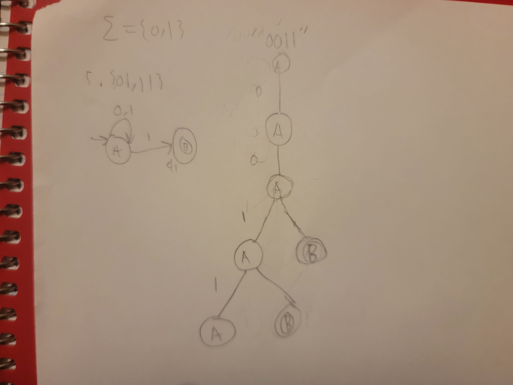

# NFA #5 {01, 11}

# multiple runs

# step-by-step of initial attempt

# computation tree of initial attempt

- original design did not accept only 01 or 11 and instead accepted any string ending with 1