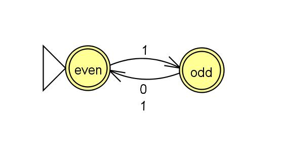
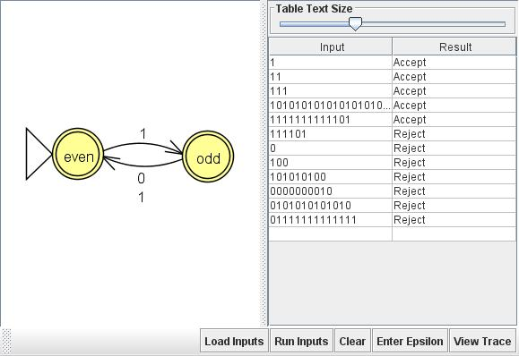
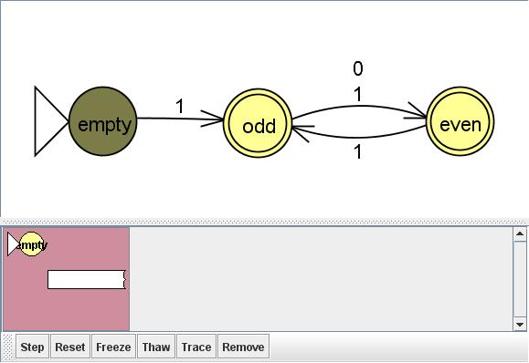
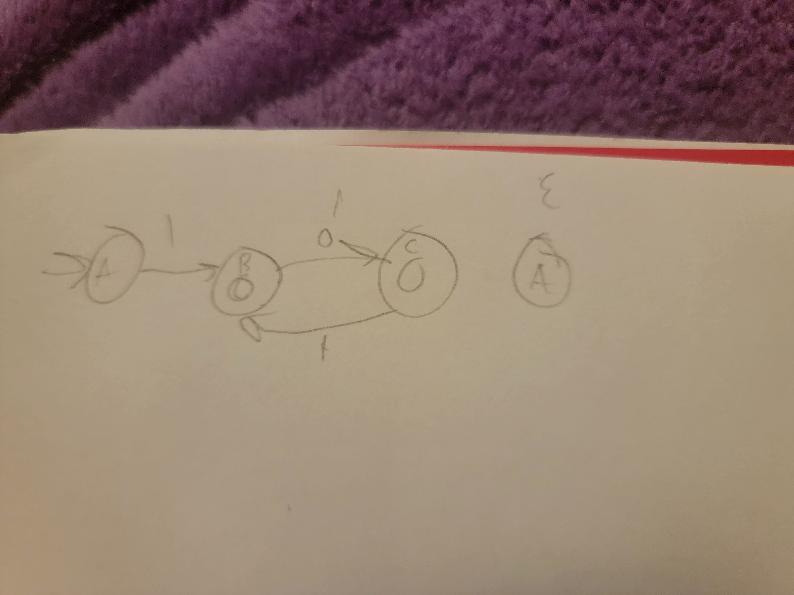

# NFA 16 {string s| every odd position of s is 1, starting at 1 in positional index }

# multiple runs

# step by step of initial attempt

# computation tree of initial attempt

- original design assumed string length had to be at least 1, even though empty strings should be accepted by the set